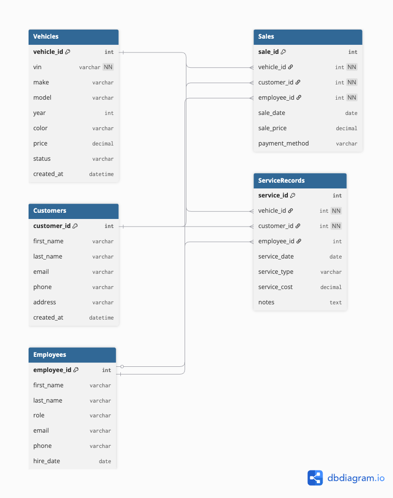

# 🚗 Car Dealership Management System

A database-driven system designed to manage vehicle inventory, customer data, sales transactions, and service records using MySQL.

> Built to simulate real-world dealership operations with automated workflows, relational data integrity, and business insights.

---

## 💡 Why This Project?

Car dealerships manage large volumes of data daily from tracking vehicles and customers to processing sales and maintaining service records.

This system was built to:

* Organize dealership data efficiently using relational databases
* Automate updates using SQL triggers and stored procedures
* Generate insights for business decision-making
* Simulate real-world data workflows used in industry

---

## 🏗️ Database Architecture

The system is structured into the following core entities:

* **Vehicles** – Stores inventory details (make, model, price, status)
* **Customers** – Stores customer information
* **Employees** – Tracks dealership staff
* **Sales** – Records transactions between customers and vehicles
* **ServiceRecords** – Tracks maintenance and service history

All tables are relationally linked using foreign keys to ensure:

* Data consistency
* Referential integrity
* Efficient querying

---

## 📊 Example Business Queries

### Monthly Revenue

```sql
SELECT MONTH(sale_date) AS month, SUM(sale_price) AS total_revenue
FROM Sales
GROUP BY MONTH(sale_date);
```

**Example Output:**

| Month | Total Revenue |
| ----- | ------------- |
| 1     | $45,000       |
| 2     | $52,300       |
| 3     | $61,200       |

---

### Top-Selling Vehicles

```sql
SELECT vehicle_id, COUNT(*) AS total_sales
FROM Sales
GROUP BY vehicle_id
ORDER BY total_sales DESC;
```

---

### Customer Service History

```sql
SELECT c.first_name, c.last_name, s.service_type, s.service_date
FROM Customers c
JOIN ServiceRecords s ON c.customer_id = s.customer_id;
```

---

## ⚙️ How to Run This Project

1. Clone the repository:

```bash
git clone https://github.com/CV17-09/Car-Dealership-Management-System.git
```

2. Open MySQL

3. Run the schema file:

```sql
SOURCE sql/schema.sql;
```

4. (Optional) Load sample data:

```sql
SOURCE sql/sample_data.sql;
```

5. Run queries from:

```sql
SOURCE sql/queries.sql;
```

---

## 🎬 Demo Walkthrough


---

## 🧩 Key Features

* Vehicle inventory management
* Customer and sales tracking
* Service history tracking
* SQL triggers for automated updates
* Stored procedures for reusable logic
* Complex queries for business insights

---

## 🛠️ Technologies Used

* MySQL
* SQL (Joins, Subqueries, Aggregations)
* Stored Procedures
* Triggers
* Views

---

## 📁 Project Structure

```
Car-Dealership-Management-System/
│
├── sql/
│   ├── schema.sql
│   ├── queries.sql
│   └── triggers.sql
│
├── docs/
│   └── erd.png
│
├── README.md
└── LICENSE
```

---

## 🗺️ Database ERD

This diagram shows the relationships between all major entities in the system.



---

## 🚀 Future Improvements

* Build a web interface (React + Node.js)
* Add authentication and role-based access
* Integrate dashboards (Power BI or Tableau)
* Deploy using a cloud database (AWS RDS / Azure SQL)
* Add real-time analytics features

---

## 💼 Resume Description

**Car Dealership Management System**

* Designed and implemented a relational database using MySQL to manage inventory, customers, sales, and service records
* Developed SQL triggers and stored procedures to automate workflows and enforce business rules
* Created complex queries for revenue analysis, customer insights, and sales trends
* Structured normalized database schema with strong relational integrity

---

## 📄 License

This project is licensed under the MIT License.


